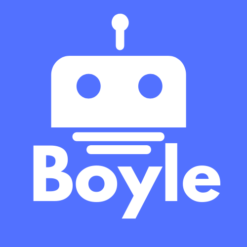
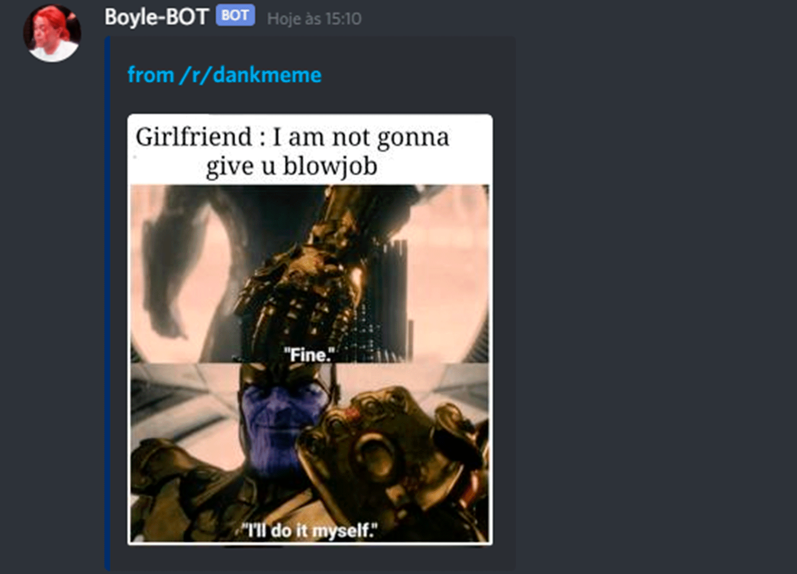

<h1 align="center">
<br>
  
<br>
<br>
Boyle-BOT
</h1>

<p align="center">🤖 A Discord Server Manager BOT</p>

<p align="center">
  <a href="https://opensource.org/licenses/MIT">
    
  </a>
</p>

<div align="center">
  
</div>

<hr />

## Features
This app features all the latest tools and practices in mobile development!

- ⚛️ **Discord js** — A JavaScript library that integrates discord API
- 💹 **Node Js** — A web framework for Node Js

## Getting started

Install the Dependencies

> npm install

Create a dotenv file to setup the Bot

#### TOKEN

You can get your bot token on Discord Developer Portal, following this steps.

- **Create an aplication**
- **Turn into a bot**
- **Copy your new token**

```
TOKEN=<bot_token>
PREFIX=<prefix>
```

## Starting Bot

Execute the main file with node.

> node index.js

## Versions

- **1.0.0** Init project with standard commands to manage a server.

<hr>

> Usage < needed > [ optional ]

| Command | Category | Description | Usage |
  ------------ | ------------- | ------------- | -----------
  Ping | Info | Returns the bot and Api's ping
  Whois  | Info | Returns user info | [ mention / id ]
  Help | Info | Return all commands, or one specific command info | [ command ]
  Kick | Moderation | Kick a member from server | < mention / id > < reason >
  Ban | Moderation | Ban a member from server | < mention / id > < reason >
  Sban | Moderation | Ban and unban a member from server | < mention / id > < reason >
  Report | Moderation | Report a member | < mention / id > < reason >
  Clear | Moderation | Clear the chat | [ amount ]
  Love | Fun | Calculate the love affinity you have for another person. | [ mention ]
  Meme | Fun | Sends a meme on chat | 
  Roll | Fun | Roll a dice | < d+Number > [ +Number / -Number / *Number / /Number ]

## Contribution

Pull requests are welcome. For major changes, please open an issue first to discuss what you would like to change.
Please make sure to update tests as appropriate.

## License

This project is licensed under the MIT License - see the [LICENSE](LICENSE) page for details.